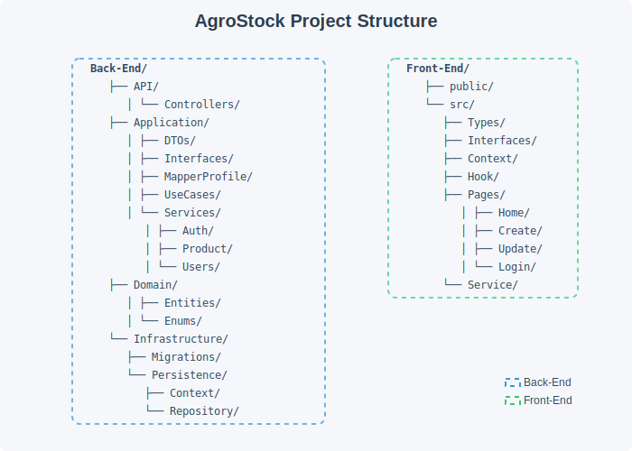

# 🧑‍🌾 AgroStock

Sistema de Gestão de Estoque Agroindustrial — um projeto full-stack com autenticação, controle de produtos e persistência de dados.

## 📌 Funcionalidades

- Cadastro, listagem, edição e remoção de produtos
- Controle de quantidade (estoque) por produto
- Autenticação de usuários (Admin e User padrão)
- Back-end em .NET 9 com arquitetura em camadas
- Front-end moderno com React + TypeScript + Vite + TailwindCSS
- Uso de JWT para autenticação
- Banco de dados SQL Server

## 🛠️ Tecnologias

### Back-End:

- .NET 9
- Entity Framework Core
- JWT (Json Web Token)
- SQL Server
- Clean Architecture

### Front-End:

- React
- Vite
- TypeScript
- TailwindCSS

## 🚀 Como rodar o projeto

### 🔧 Configurações importantes antes de iniciar

#### 1. Configurar credenciais dos usuários de teste

Abra o arquivo: `/Back-End/Application/Services/Users/UserService.cs`

Edite os usuários padrões se desejar:

```csharp
new User { Email = "Admin@email.com", Password = "12345678910", Role = Roles.Admin },
new User { Email = "User@email.com", Password = "123456789", Role = Roles.User }
```

#### 2. Configurar a string de conexão com o SQL Server

Edite o arquivo: `/Back-End/API/appsettings.Development.json`

Configure a string de conexão para o SQL Server:

```json
"ConnectionStrings": {
    "ConnectionDefault": "Server=localhost;Database=AgroStockDb;TrustServerCertificate=True;"
}
```

#### 3. Configurar a senha de assinatura do token JWT

Abra o arquivo: `/Back-End/Application/Services/Auth/JwtSettings.cs`

Edite a propriedade SecretKey com uma chave segura:

```csharp
public string SecretKey { get; set; } = "SUA_CHAVE_SECRETA_FORTE";
```

Se desejar, ajuste também os valores de `Issuer`, `Audience`, e `ExpireMinutes`.

### ▶️ Rodando o projeto

**Back-End:**

```bash
cd Back-End
dotnet restore
dotnet ef database update
cd API
dotnet run
```

**Front-End:**

```bash
cd Front-End
npm install
npm run dev
```

## 📂 Estrutura simplificada



## ✅ Usuários de Teste

| Email           | Senha       | Perfil |
| --------------- | ----------- | ------ |
| Admin@email.com | 12345678910 | Admin  |
| User@email.com  | 123456789   | User   |


## 🙋‍♂️ Autor

Feito por Miguel — [LinkedIn](https://www.linkedin.com/in/miguel-oliveira-castro) | [GitHub](https://github.com/miguel-oliveirRa/)
